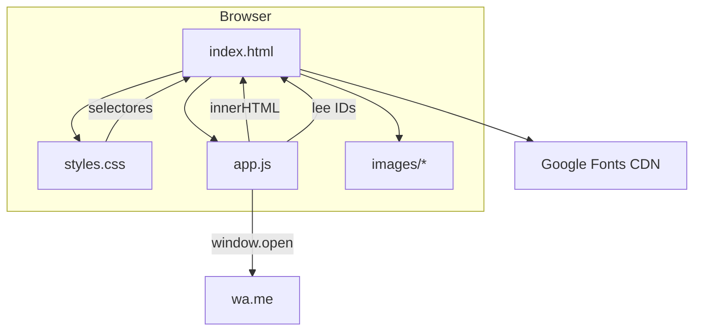
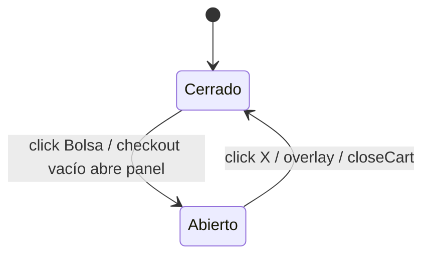
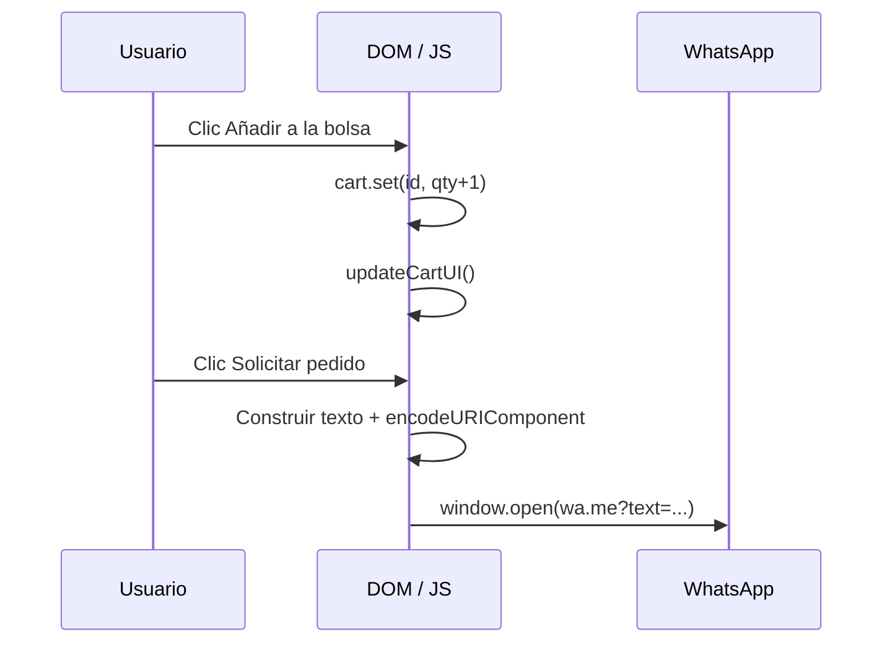

# Documentación de arquitectura — Anna Objetos Hechos a Mano

**Sitio:** vitrina estática + catálogo interactivo + bolsa de compras con cierre por WhatsApp  
**Repositorio:** `anna_objetoshechosamano`  
**Última revisión del documento:** 2026-05-08  

---

## Tabla de contenidos

1. [Resumen ejecutivo](#1-resumen-ejecutivo)  
2. [Tipo de sistema y restricciones](#2-tipo-de-sistema-y-restricciones)  
3. [Inventario de archivos y dependencias](#3-inventario-de-archivos-y-dependencias)  
4. [Arquitectura de capas](#4-arquitectura-de-capas)  
5. [Documento HTML: estructura y contratos con JavaScript](#5-documento-html-estructura-y-contratos-con-javascript)  
6. [Hoja de estilos: sistema de diseño y layout](#6-hoja-de-estilos-sistema-de-diseño-y-layout)  
7. [Aplicación cliente (`app.js`): datos, estado y flujos](#7-aplicación-cliente-appjs-datos-estado-y-flujos)  
8. [Flujos de usuario detallados](#8-flujos-de-usuario-detallados)  
9. [Accesibilidad (a11y)](#9-accesibilidad-a11y)  
10. [Seguridad, privacidad y límites del modelo](#10-seguridad-privacidad-y-límites-del-modelo)  
11. [Rendimiento y red](#11-rendimiento-y-red)  
12. [Internacionalización y contenido](#12-internacionalización-y-contenido)  
13. [Despliegue y operación](#13-despliegue-y-operación)  
14. [Evolución recomendada](#14-evolución-recomendada)  
15. [Diagramas](#15-diagramas)  
16. [Referencias rápidas al código](#16-referencias-rápidas-al-código)  

---

## 1. Resumen ejecutivo

Este proyecto es una **aplicación web de una sola página (SPA estática)** construida sin framework y sin paso de compilación: un único `index.html` carga `styles.css` y `app.js`. La **información comercial** (productos, precios en COP, textos descriptivos e imágenes) está **embebida en el cliente** (`app.js` y carpeta `images/`).

La **bolsa de compras** mantiene el estado **solo en memoria del navegador** (objeto `Map`). No existe servidor de aplicación, base de datos ni API REST en el alcance actual del repositorio. El **cierre de pedido** delega en **WhatsApp Web/App** mediante la API pública `https://wa.me/<número>?text=<mensaje codificado>`, de modo que el taller confirma pago y envío por el canal que ya usa el negocio.

El diseño visual está **fuertemente basado en tokens CSS** (`:root`): paleta inspirada en la marca (coral, magenta, teal, dorado), tres familias tipográficas de Google Fonts y componentes reutilizables (botones, tarjetas de producto, panel lateral tipo drawer).

---

## 2. Tipo de sistema y restricciones

| Aspecto | Decisión en el proyecto |
|--------|-------------------------|
| **Paradigma** | Multi-página **no**: todo el contenido principal vive en un documento; la “navegación” es scroll + anclas `#`. |
| **Renderizado** | **CSR ligero**: el catálogo se pinta con plantillas en cadena y `innerHTML` tras `DOMContentLoaded` implícito (script al final del `body`). |
| **Estado** | **Volátil**: recargar la página vacía el carrito. |
| **Pagos** | **Fuera de alcance** en código: no hay Stripe, PayU, ni pasarela embebida. |
| **Stock** | **No modelado**: no hay descuento de inventario ni reservas. |
| **Autenticación** | **No hay** usuarios ni sesiones de servidor. |

Estas restricciones son adecuadas para una **vitrina artesanal** con volumen de pedidos manejable por WhatsApp; si el negocio escala, conviene replantear backend o al menos persistencia y catálogo externo (véase [§14](#14-evolución-recomendada)).

---

## 3. Inventario de archivos y dependencias

### 3.1 Archivos fuente en el repositorio

| Ruta | Función |
|------|---------|
| `index.html` | Documento único: metadatos, marcas semánticas, regiones de página, IDs consumidos por JS, carga de fuentes y scripts. |
| `styles.css` | ~844 líneas: variables globales, layout, componentes, estados del carrito, media queries. |
| `app.js` | ~270 líneas: catálogo, formato moneda, render de tarjetas, carrito, checkout WhatsApp, año en footer. |
| `images/` | Activos: logo (`Logo.jpeg` referenciado en HTML), fotografías de producto y hero (`WhatsApp Image …jpeg`, etc.), `polymer-placeholder.svg` como imagen de respaldo. |

### 3.2 Dependencias externas (red)

| Recurso | Uso |
|---------|-----|
| `fonts.googleapis.com` / `fonts.gstatic.com` | `preconnect` + hoja CSS de Google Fonts con **Lilita One**, **Montserrat**, **Nunito**. |
| `wa.me` | Deep links de WhatsApp para contacto flotante, CTA de contacto y **checkout** (`checkoutWhatsApp`). |
| `instagram.com` | Enlaces a `@anna_objetoshechosamano` (perfil público). |

No hay `npm`, `package.json`, ni CDN de librerías JS (no React, Vue, jQuery, etc.).

---

## 4. Arquitectura de capas

```
┌─────────────────────────────────────────────────────────────┐
│  Capa de presentación (HTML)                                 │
│  Estructura semántica, textos estáticos, huecos (#productGrid) │
└───────────────────────────┬─────────────────────────────────┘
                            │
┌───────────────────────────▼─────────────────────────────────┐
│  Capa de estilo (CSS)                                        │
│  Tokens, grid/flex, estados .is-open, body.cart-open         │
└───────────────────────────┬─────────────────────────────────┘
                            │
┌───────────────────────────▼─────────────────────────────────┐
│  Capa de comportamiento (JS)                                 │
│  Datos PRODUCTS, Map cart, manipulación DOM, window.open       │
└───────────────────────────┬─────────────────────────────────┘
                            │
              ┌─────────────┴─────────────┐
              ▼                           ▼
        Sistema de archivos          WhatsApp (HTTP/S)
        (imágenes locales)           mensaje de pedido
```

- **Acoplamiento:** `app.js` conoce **IDs y clases** definidos en `index.html` y esperados en `styles.css`. Cambiar un ID sin actualizar JS rompe la página.  
- **Separación:** los datos de producto están en JS, no en HTML; el HTML solo reserva el contenedor `#productGrid`.

---

## 5. Documento HTML: estructura y contratos con JavaScript

### 5.1 Metadatos y cabecera

- `lang="es-CO"`: indica español (Colombia) para lectores y SEO.  
- `viewport` estándar para diseño responsive.  
- `meta description` y `<title>` alineados con marca y producto (aretes, arcilla polimérica, envíos Colombia).

### 5.2 Regiones lógicas (orden visual en pantalla)

1. **`header.site-header`**  
   - Sticky + blur (CSS).  
   - **Logo:** `img.logo-mark` → `images/Logo.jpeg`.  
   - **`nav`:** enlaces `#coleccion`, `#nosotros`, `#contacto`.  
   - **Bolsa:** `button#cartToggle` con `aria-expanded`, `aria-controls="cartPanel"`, contador `#cartCount`.

2. **`section.hero`**  
   - Fondo decorativo `.hero-bg`, imagen lateral `.hero-visual` (solo visible desde ~900px).  
   - CTA “Ver colección” → `#coleccion`.

3. **`main#coleccion`**  
   - **`#productGrid`:** vacío en HTML; **debe** ser rellenado por `renderProducts()` en `app.js`.

4. **`section#nosotros`**  
   - Contenido estático + imagen del taller.

5. **`section#contacto`**  
   - Enlaces a Instagram y WhatsApp con URLs absolutas y query prefijada en WA.

6. **`footer.site-footer`**  
   - **`#year`:** asignado por JS al año actual.

7. **WhatsApp flotante**  
   - `a.wa-float` con número visible en `aria-label` y texto oculto accesible vía `.wa-float__label` (técnica de “visually hidden” en CSS).

8. **Carrito (drawer)**  
   - **`aside#cartPanel`** + **`#cartOverlay`**.  
   - **`#cartLines`**, **`#cartTotal`**, botones `#cartClose`, `#checkoutBtn`.

### 5.3 Contrato DOM ↔ JavaScript

Los siguientes IDs son **obligatorios** para que `app.js` funcione sin errores:

| ID | Uso en `app.js` |
|----|------------------|
| `productGrid` | Contenedor del grid de tarjetas. |
| `cartCount` | Texto del número de ítems en la bolsa. |
| `cartLines` | Lista `<ul>` de líneas de pedido. |
| `cartTotal` | Total formateado en COP. |
| `cartToggle` | Abrir panel. |
| `cartClose` | Cerrar panel. |
| `cartOverlay` | Cerrar al clic fuera. |
| `checkoutBtn` | Disparar `checkoutWhatsApp`. |
| `cartPanel` | Atributos ARIA y clase `is-open`. |
| `year` | Año en footer. |

---

## 6. Hoja de estilos: sistema de diseño y layout

### 6.1 Tokens en `:root`

La paleta y la tipografía están centralizadas para **consistencia** y para poder **ajustar marca** en un solo bloque.

**Colores de marca y acento** (ejemplos): `--coral`, `--coral-soft`, `--gold`, `--gold-hot`, `--teal`, `--teal-deep`, `--magenta`, `--cyan`, `--pink-soft`, `--pink-brand`, `--orange`, `--green`, `--purple`, `--red-pop`.

**Superficies y texto:**

- `--bg`, `--bg-alt` (gradiente), `--bg-alt-solid`, `--ink`, `--muted`, `--card`.  
- `--radius`, `--shadow`, `--shadow-hover`.

**Tipografía:**

- `--font-anna`: **Lilita One** — palabra “anna” al estilo logo.  
- `--font-display`: **Montserrat** — títulos, navegación, precios, botones.  
- `--font-body`: **Nunito** — cuerpo de lectura.

### 6.2 Patrones de layout

| Patrón | Dónde |
|--------|--------|
| Contenedor centrado | `.wrap` → `width: min(1120px, 92vw)` |
| CSS Grid auto-fill | `.product-grid` → `repeat(auto-fill, minmax(260px, 1fr))` |
| Dos columnas ≥768px | `.about` → `grid-template-columns: 1fr 1fr` |
| Sticky header | `.site-header` → `position: sticky; z-index: 50` |
| Drawer derecho | `.cart-panel` → `fixed`, `transform: translateX(100%)` hasta `.is-open` |

### 6.3 Breakpoints relevantes

| Condición | Comportamiento |
|-----------|----------------|
| `min-width: 900px` | `.hero-visual` visible (foto hero a la derecha). |
| `min-width: 768px` | Sección “Nosotros” en dos columnas. |
| `max-width: 767px` | Texto “Nosotros” centrado; nota con `max-width` y borde izquierdo. |
| `max-width: 640px` | **`.nav` oculto** (solo logo + bolsa); usuarios dependen de scroll/CTA. |

### 6.4 Componentes UI destacados

- **`.brand-anna` / `.brand-tagline`:** refuerzo de identidad en hero, cards y copy.  
- **`.btn`, `.btn-primary`, `.btn-outline`, `.btn-block`:** CTAs con hover (`translateY`, sombras).  
- **`.product-card`:** tarjeta con sombra, hover elevado, ratio 4:5 en figura.  
- **`.product-brand-badge`:** superposición sobre foto (`pointer-events: none`).  
- **`.wa-float`:** botón fijo con `z-index: 120`, respeta `safe-area-inset` en móviles.  
- **Carrito:** `.cart-overlay` (z-index 90), `.cart-panel` (z-index 100), `body.cart-open { overflow: hidden }` evita scroll de fondo cuando el drawer está abierto.

---

## 7. Aplicación cliente (`app.js`): datos, estado y flujos

### 7.1 Constantes de configuración

| Nombre | Rol |
|--------|-----|
| `WA_NUMBER` | Identificador de WhatsApp para URLs `wa.me` (sin `+`). Debe coincidir con el número de negocio. |
| `POLYMER_PLACEHOLDER` | Ruta al SVG si falla la carga de una foto de producto. |
| `LOCAL_PRODUCT_PHOTOS` | Array de nombres de archivo en `images/` usados al construir `imageSrc()`. |
| `PRODUCTS` | Catálogo: array de objetos producto. |

### 7.2 Esquema de un producto

Campos usados en runtime:

| Campo | Tipo | Uso |
|-------|------|-----|
| `id` | `string` | Clave única en `Map` del carrito y en `data-id` del DOM. |
| `name` | `string` | Título y líneas de WhatsApp. |
| `tag` | `string` | Categoría corta (Broquel, Earcuff, etc.). |
| `desc` | `string` | Descripción en tarjeta. |
| `price` | `number` | Precio unitario en COP (entero en la práctica). |
| `image` | `string` | URL ya resuelta (`images/...`). |
| `polymerNote` | `string` (opc.) | Refuerzo en `alt` de la imagen y mensaje artesanal. |

### 7.3 Formato de moneda

`Intl.NumberFormat("es-CO", { style: "currency", currency: "COP", maximumFractionDigits: 0 })` garantiza **formato local** sin decimales, coherente con precios enteros.

### 7.4 Estado del carrito

- **Estructura:** `const cart = new Map()` donde la clave es `product.id` y el valor es **cantidad entera** ≥ 1.  
- **No hay** líneas con cantidad 0: quitar un ítem usa `cart.delete(id)`.

### 7.5 Funciones (referencia técnica)

| Función | Entrada | Salida / efecto |
|---------|---------|-------------------|
| `imageSrc(filename)` | nombre de archivo | `encodeURI('images/' + filename)` — tolera espacios en nombres WhatsApp. |
| `formatCOP(n)` | número | Cadena COP con `Intl`. |
| `escapeHtml(s)` | string | HTML escapado vía `textContent` en elemento temporal — mitiga XSS al usar `innerHTML`. |
| `renderProducts()` | — | Limpia `#productGrid`, inserta `<article class="product-card">` por producto, engancha click en `.add-to-cart` y `error` en imágenes para fallback. |
| `addToCart(id)` | id producto | Incrementa cantidad en `Map`, llama `updateCartUI`. |
| `removeLine(id)` | id producto | Elimina línea, `updateCartUI`. |
| `updateCartUI()` | — | Suma cantidades totales, pinta lista o “Tu bolsa está vacía”, subtotales, total, listeners en `.remove-line`. |
| `openCart()` | — | ARIA y clases `is-open`, `aria-expanded=true`, `body.cart-open`. Usa `requestAnimationFrame` antes de añadir clases (transición suave). |
| `closeCart()` | — | Revierte lo anterior. |
| `checkoutWhatsApp()` | — | Si vacío, solo abre carrito; si hay ítems, construye texto multilínea y `window.open` a `wa.me` con `encodeURIComponent`. |

### 7.6 Mensaje de checkout

El texto enviado a WhatsApp incluye:

- Saludo y nombre de marca.  
- Una línea por producto: `nombre × cantidad = subtotal`.  
- Línea final: `Total: <COP>`.

Esto permite al taller **copiar/confirmar** sin depender de un panel de administración.

### 7.7 Resiliencia de imágenes

Cada `` de producto lleva `data-fallback` apuntando al SVG. En el evento `error`, si la URL actual no es ya el placeholder, se sustituye `src` y se elimina el listener para evitar bucles.

---

## 8. Flujos de usuario detallados

### 8.1 Exploración sin compra

Usuario entra → scroll o anclas → lee hero, colección, nosotros, contacto → puede salir por Instagram/WA flotante sin usar la bolsa.

### 8.2 Compra asistida por WhatsApp

1. Usuario pulsa **“Añadir a la bolsa”** en una o más tarjetas.  
2. El contador del header se actualiza.  
3. Pulsa **“Bolsa”** → se abre overlay + drawer; fondo no hace scroll (`overflow: hidden`).  
4. Opcionalmente quita líneas con **×**.  
5. Pulsa **“Solicitar pedido por WhatsApp”** → nueva pestaña/ventana con conversación y texto prellenado.

### 8.3 Navegación móvil &lt;640px

La navegación textual del header **desaparece**; el usuario llega a secciones por **scroll**, enlaces en hero/footer, o memoria de URL con hash.

---

## 9. Accesibilidad (a11y)

- **Landmarks:** `header`, `nav` con `aria-label="Principal"`, `main`, `aside` para bolsa, `footer`.  
- **Carrito:** `aria-expanded` / `aria-controls` en el botón; `aria-hidden` en panel y overlay cuando cerrados; `aria-label` en botón flotante WhatsApp.  
- **Imágenes:** `alt` descriptivo en productos; hero con `alt=""` donde la imagen es decorativa junto a texto.  
- **Contraste y foco:** botones nativos y enlaces; el botón × usa `aria-label="Quitar"` / “Cerrar”.  
- **Texto auxiliar del FAB:** etiqueta en técnicas “screen reader only” (clip) para no saturar la UI visual.

Mejoras futuras posibles: foco atrapado (focus trap) dentro del drawer, `ESC` para cerrar, anuncio en `aria-live` al añadir productos.

---

## 10. Seguridad, privacidad y límites del modelo

- **XSS:** textos de `PRODUCTS` pasan por `escapeHtml` al inyectarse en plantillas. Los IDs son alfanuméricos controlados por código.  
- **Integridad económica:** el precio mostrado y el del mensaje salen del **mismo array en memoria**; un usuario avanzado puede alterar valores en DevTools **antes** de enviar WhatsApp. El negocio debe **validar precio y disponibilidad** en la conversación (como ya sugiere la nota en la bolsa).  
- **Privacidad:** no hay cookies de analytics en el código revisado; Google Fonts implica petición a Google (considerar self-hosting de fuentes si la política de privacidad lo exige).  
- **Enlaces externos:** `rel="noopener noreferrer"` en destinos `target="_blank"` reduce riesgos de `window.opener`.

---

## 11. Rendimiento y red

- **Lazy loading:** imágenes del grid usan `loading="lazy"`; hero usa `eager` para LCP razonable.  
- **Fuentes:** `preconnect` a orígenes de Google Fonts.  
- **CSS:** un solo archivo, sin frameworks pesados.  
- **JS:** un solo archivo, sin árbol de dependencias npm.

Cuellos de botella típicos serían **peso de imágenes JPEG** sin compresión WebP/AVIF y **latencia de fuentes**; optimizar imágenes en `images/` tiene alto impacto.

---

## 12. Internacionalización y contenido

- Idioma del documento: **es-CO**.  
- Moneda: **COP** exclusivamente en formato y copy (“Precios en pesos colombianos”).  
- Número WhatsApp y usuario Instagram están **hardcodeados** en HTML y JS; cambiar de número implica editar **varias ubicaciones** (`WA_NUMBER`, `wa.me`, `aria-label` del flotante, etc.) — candidato a centralización futura.

---

## 13. Despliegue y operación

- **Artefacto:** archivos estáticos servidos por cualquier hosting (GitHub Pages, Netlify, S3+CloudFront, nginx, etc.).  
- **HTTPS:** recomendado para SEO y para que `wa.me` y redes externas se comporten bien desde contextos seguros.  
- **Rutas:** todo es relativo a la raíz del sitio (`styles.css`, `app.js`, `images/`); desplegar en subcarpeta puede requerir ajustar rutas o `<base href>`.

---

## 14. Evolución recomendada

1. **Centralizar negocio:** un solo `config.js` o JSON con teléfono, redes, textos legales.  
2. **Catálogo externo:** `products.json` + `fetch`, o CMS headless.  
3. **Persistencia:** `localStorage` o `sessionStorage` para carrito.  
4. **Build opcional:** Vite/esbuild para minificar y versionar; TypeScript para tipar `PRODUCTS`.  
5. **PWA:** manifest + service worker para instalación y caché offline ligero.  
6. **Analytics:** con consentimiento explícito según normativa aplicable.

---

## 15. Diagramas

### 15.1 Dependencias entre artefactos



### 15.2 Estado del panel de bolsa



### 15.3 Secuencia: añadir y pedir por WhatsApp



---

## 16. Referencias rápidas al código

| Tema | Ubicación aproximada |
|------|----------------------|
| Metadatos y secciones | `index.html` |
| Tokens `:root` y header | `styles.css` líneas 1–190 |
| Hero y breakpoints 900px | `styles.css` ~191–264 |
| Grid de productos | `styles.css` ~398–519 |
| About / Contact / Footer | `styles.css` ~521–697 |
| Carrito drawer | `styles.css` ~699–828 |
| Nav móvil oculto | `styles.css` ~830–843 |
| Catálogo y carrito | `app.js` |

---

*Este documento describe el comportamiento del código en el repositorio en la fecha de revisión. Cualquier cambio en IDs, archivos o flujos debería reflejarse aquí para mantener la documentación alineada con el producto.*
