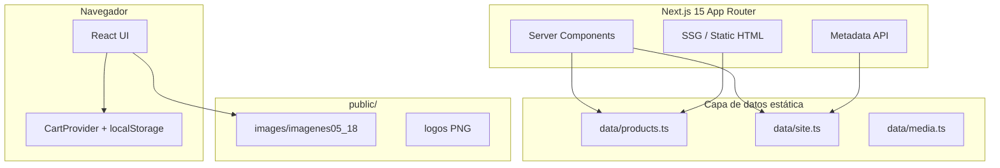
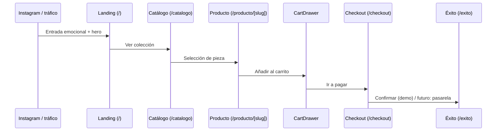
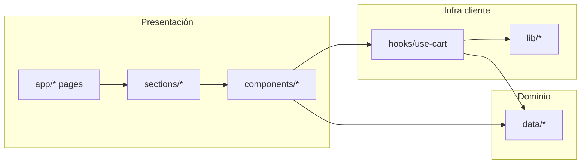
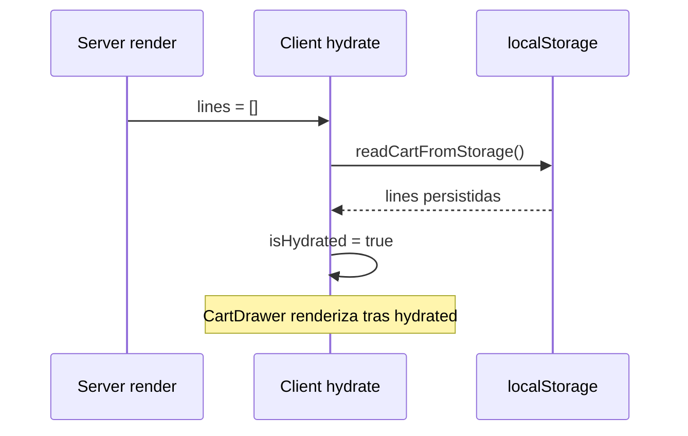
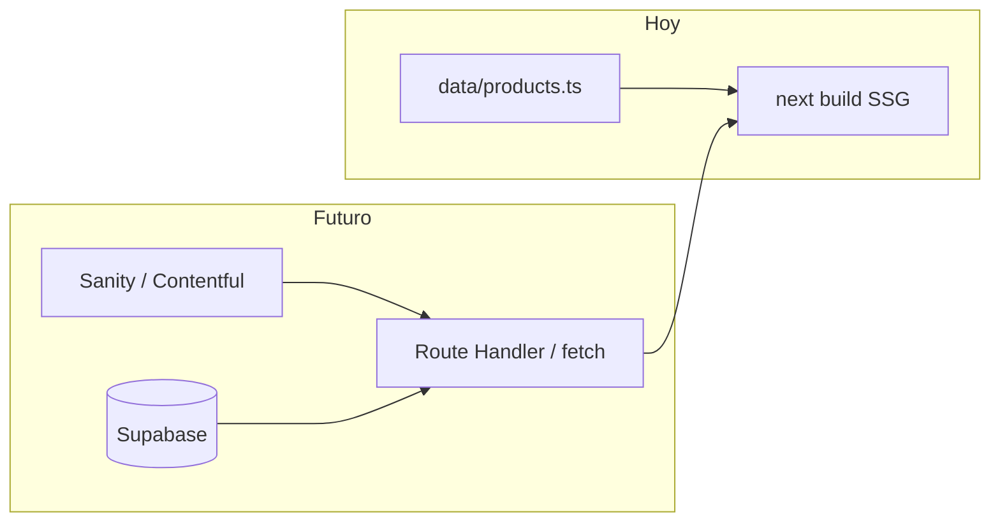
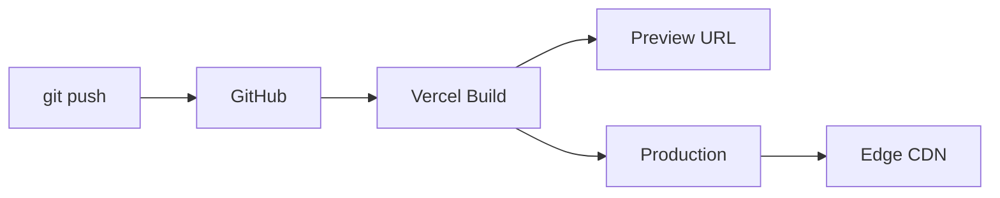
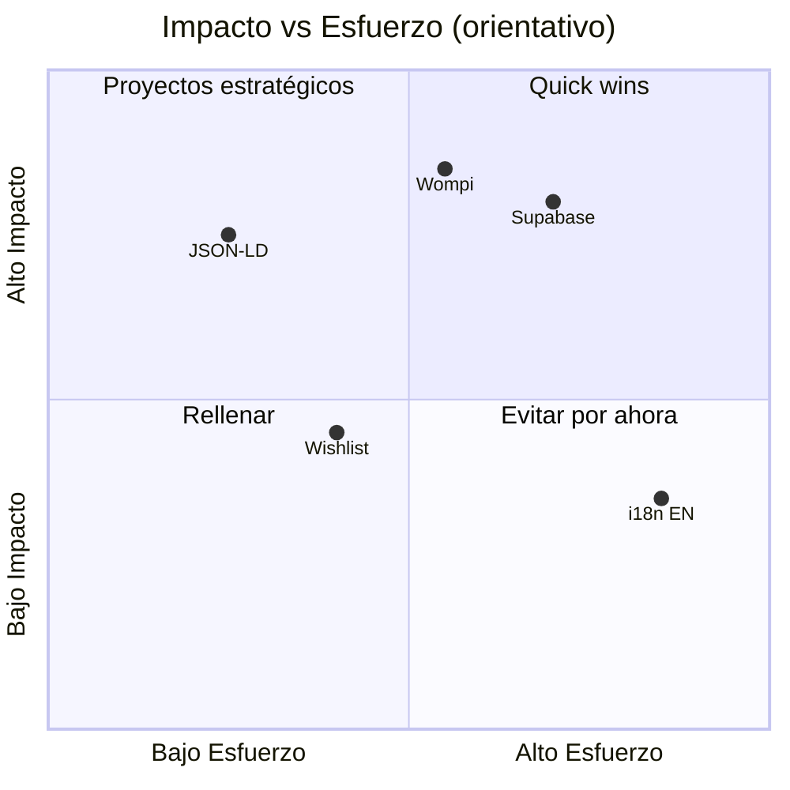

# Documentación técnica — Anna Objetos Hechos a Mano

**Proyecto:** `anna_objetoshechosamano`  
**Tipo:** Ecommerce frontend artesanal (Next.js App Router)  
**Última revisión:** 2026-05-18  
**Audiencia:** desarrolladores senior, equipos frontend, mantenedores, agencias, revisión de portafolio  

---

## Tabla de contenidos

1. [Resumen ejecutivo](#1-resumen-ejecutivo)
2. [Filosofía de diseño y marca](#2-filosofía-de-diseño-y-marca)
3. [Stack tecnológico](#3-stack-tecnológico)
4. [Arquitectura general del proyecto](#4-arquitectura-general-del-proyecto)
5. [Routing y App Router](#5-routing-y-app-router)
6. [Sistema de componentes](#6-sistema-de-componentes)
7. [Sistema visual y Tailwind](#7-sistema-visual-y-tailwind)
8. [Manejo de estado](#8-manejo-de-estado)
9. [Catálogo y modelo de datos](#9-catálogo-y-modelo-de-datos)
10. [Ecommerce y flujo de compra](#10-ecommerce-y-flujo-de-compra)
11. [Responsive y mobile-first](#11-responsive-y-mobile-first)
12. [Performance](#12-performance)
13. [Accesibilidad](#13-accesibilidad)
14. [SEO y metadata](#14-seo-y-metadata)
15. [Animaciones y motion system](#15-animaciones-y-motion-system)
16. [Integraciones futuras](#16-integraciones-futuras)
17. [Deployment y operación](#17-deployment-y-operación)
18. [Convenciones de código](#18-convenciones-de-código)
19. [Riesgos técnicos y limitaciones](#19-riesgos-técnicos-y-limitaciones)
20. [Roadmap técnico](#20-roadmap-técnico)

---

## 1. Resumen ejecutivo

### 1.1 Qué es el proyecto

**Anna Objetos Hechos a Mano** es una aplicación web de ecommerce orientada a la venta de **accesorios artesanales en arcilla polimérica** (aretes, candongas, collares, earcuffs, anillos, llaveros). No es una vitrina estática: implementa **catálogo navegable**, **páginas de producto (PDP)**, **carrito persistente**, **checkout estructurado** y una experiencia de marca diseñada para conversión emocional desde tráfico móvil e Instagram.

El código vive en un monorepo frontend único. La carpeta `legacy/` conserva la versión anterior (HTML + CSS + JS vanilla) solo como referencia histórica; **el sistema en producción es Next.js 15**.

### 1.2 Objetivo del ecommerce

| Objetivo | Implementación actual |
|----------|----------------------|
| Mostrar catálogo real con fotos del taller | `data/products.ts` + `public/images/imagenes05_18/` |
| Reducir fricción de compra vs. WhatsApp manual | Carrito + checkout con formulario (Fase 2: pasarela) |
| Transmitir identidad handmade | Diseño editorial, tipografía de marca, secciones storytelling |
| Preparar escala técnica | Tipos estrictos, capas separadas, SSG de PDPs |
| Mobile-first | Layouts, sticky CTA, drawer de carrito, grids adaptativos |

### 1.3 Filosofía de experiencia

La UX busca que el usuario **sienta el taller**: color, textura, proceso visible (sección taller con medios), historia de marca y lenguaje cercano. La conversión no se apoya en urgencia agresiva tipo retail masivo, sino en **confianza artesanal + claridad del flujo de compra**.

### 1.4 Arquitectura general (vista de pájaro)



### 1.5 Stack resumido

| Capa | Tecnología |
|------|------------|
| Framework | Next.js 15.3+ (App Router) |
| UI | React 19 |
| Lenguaje | TypeScript 5.8 |
| Estilos | Tailwind CSS v4 (`@theme`, `@import "tailwindcss"`) |
| Motion | Framer Motion 12 |
| Fuentes | `next/font/google` (Lilita One, Montserrat, Nunito) |
| Deploy objetivo | Vercel |
| Persistencia cliente | `localStorage` (`anna-cart-v1`) |
| Backend | **No existe** en esta fase |

### 1.6 Flujo principal de compra



### 1.7 Contexto de negocio

- **Mercado:** Colombia (`es-CO`, COP).
- **Canal de adquisición principal:** Instagram (`@anna_objetoshechosamano`).
- **Operación actual del taller:** producción handmade, variación natural entre piezas.
- **Evolución comercial:** pasar de “pedido por chat” a **checkout con pasarela** (Wompi / Mercado Pago planificado).

---

## 2. Filosofía de diseño y marca

### 2.1 Identidad visual

La marca **no adopta minimalismo corporativo frío** (blanco + gris + sans genérico). En su lugar usa:

- **Paleta cálida y vibrante** heredada del sitio legacy y del logo: coral, magenta, teal, cyan, dorado, violeta profundo (`ink`).
- **Tipografía con personalidad:** Lilita One para la palabra *anna*, Montserrat para titulares, Nunito para cuerpo.
- **Superficies “editoriales”:** gradientes suaves de sección, bordes redondeados generosos, sombras con tinte magenta/violeta.
- **Decoración artesanal controlada:** stickers flotantes, badges “Hecho a mano”, formas (`ArtShapes`) sin saturar la interfaz.

**Razonamiento:** el comprador de joyería handmade compra **emoción y autenticidad**. Un diseño demasiado “SaaS” rompería la coherencia con el taller y reduciría confianza percibida.

### 2.2 Relación diseño ↔ conversión

| Decisión visual | Efecto en conversión |
|-----------------|----------------------|
| CTA con gradiente coral (`btn-playful-primary`) | Alto contraste, acción clara sin parecer agresiva |
| Badge “Hecho a mano” en tarjetas | Refuerzo de valor diferencial |
| Precio en coral, tipografía display | Jerarquía inmediata del costo |
| Drawer de carrito con marca visible | Continuidad emocional en momento de pago |
| Fondo con textura de puntos + washes | Sensación “cuidada” vs. plantilla genérica |

### 2.3 Componentes de marca en código

| Activo / componente | Ubicación | Uso |
|---------------------|-----------|-----|
| Logo circular | `siteConfig.logos.circular` | Header (`BrandLogo variant="circular"`) |
| Logo plano | `siteConfig.logos.flat` | Hero, footer, drawer |
| `BrandAnna` | `components/brand/BrandAnna.tsx` | Texto inline “anna” con clase `.brand-anna` |
| `BrandLogo` | `components/brand/BrandLogo.tsx` | Wrapper de `next/image` con tamaños predefinidos |

La clase `.brand-anna` fuerza **minúsculas + Lilita + rosa marca**, alineada con el wordmark físico.

### 2.4 Experiencia editorial

Las **sections** (`sections/*`) componen la home como revista:

1. Hero — propuesta de valor + video taller  
2. Destacados / Novedades / Más vendidos — merchandising  
3. Historia — narrativa de marca  
4. Taller — proceso (foto + video)  
5. Testimonios, Instagram, FAQ — confianza y resolución de objeciones  

Cada bloque tiene **eyebrow + titular display** (`SectionHeader`) para ritmo de lectura escaneable en móvil.

---

## 3. Stack tecnológico

### 3.1 Next.js 15 (App Router)

**Por qué:** routing basado en filesystem, layouts anidados, Server Components por defecto, `generateStaticParams` para PDPs, Metadata API unificada, optimización de imágenes integrada.

**Implicaciones en este proyecto:**

- Páginas de producto se **pre-renderizan en build** (30 rutas estáticas al momento de documentar).
- `/catalogo` es **dinámica** (`ƒ`) por `searchParams` (filtros `filter`, `coleccion`).
- Layout raíz envuelve toda la app con `CartProvider`, header, footer y drawer.

**No se usa:** Pages Router, API Routes propias, middleware personalizado (aún).

### 3.2 React 19

Componentes funcionales, hooks, Context para carrito. Los límites **client/server** se respetan con `"use client"` solo donde hay estado, efectos o Framer Motion.

### 3.3 TypeScript

Tipado de dominio en `data/products.ts` (`Product`, `ProductCategory`), props de componentes, y helpers. El compilador actúa como **contrato** entre catálogo y UI.

### 3.4 Tailwind CSS v4

Configuración **CSS-first** en `styles/globals.css`:

```css
@import "tailwindcss";

@theme {
  --color-coral: #f55847;
  /* ... tokens de marca ... */
}
```

Ventajas: tokens centralizados, utilidades generadas desde variables, menos `tailwind.config.js` imperativo.

### 3.5 Framer Motion

Usado para:

- Entradas al scroll (`FadeIn` con `whileInView`)
- Drawer de carrito (`AnimatePresence`, spring en eje X)
- Microinteracción en `Button` (`whileHover` / `whileTap`)

**Criterio:** motion con propósito (jerarquía, feedback), no animación decorativa masiva en listados largos.

### 3.6 Vercel (deploy objetivo)

- Build: `next build`
- Output: estático híbrido (SSG + server para rutas dinámicas)
- Preview deployments por PR
- Variables: `NEXT_PUBLIC_SITE_URL` para metadata absoluta

---

## 4. Arquitectura general del proyecto

### 4.1 Árbol de carpetas (responsabilidades)

```
tienda-arcilla-polimerica/
├── app/                    # Rutas App Router + metadata por ruta
├── components/
│   ├── brand/              # Logo y wordmark
│   ├── layout/             # Header, footer, cart drawer
│   ├── media/              # WorkshopVideo (hero / reels)
│   ├── product/            # Tarjetas, grid, PDP, sticky CTA
│   └── ui/                 # Primitivos (Button, FadeIn, ArtShapes)
├── sections/               # Bloques composables de marketing (home)
├── hooks/                  # CartProvider (Context API)
├── data/                   # Fuente de verdad estática (productos, site, media)
├── lib/                    # Utilidades puras (format, storage, cn)
├── styles/                 # globals.css — tokens + utilidades de marca
├── public/images/          # Assets estáticos servidos tal cual
├── docs/                   # Esta documentación
└── legacy/                 # Sitio HTML anterior (no participa en build)
```

### 4.2 Separación de capas



| Capa | Regla |
|------|--------|
| `data/` | Sin JSX. Solo tipos, arrays, funciones de consulta. |
| `lib/` | Funciones puras, sin React. |
| `hooks/` | Estado global de cliente (carrito). |
| `components/` | UI reutilizable; puede ser server o client. |
| `sections/` | Orquestación de bloques de página; mayormente server components que importan client children. |
| `app/` | Routing, metadata, composición de página. |

### 4.3 Estrategia de composición

- **Container editorial:** `.container-editorial` (`max-w-6xl`, padding responsivo) alinea todo el contenido.
- **Sections** no conocen el router; reciben datos vía imports de `data/`.
- **ProductCard** es el átomo de merchandising; **ProductGrid** solo mapea array → cards.

### 4.4 Alias de importación

`@/*` → raíz del proyecto (configurado en `tsconfig.json`). Ejemplo: `@/data/products`.

---

## 5. Routing y App Router

### 5.1 Mapa de rutas

| Ruta | Archivo | Rendering | Descripción |
|------|---------|-----------|-------------|
| `/` | `app/page.tsx` | Static (○) | Home con sections apiladas |
| `/catalogo` | `app/catalogo/page.tsx` | Dynamic (ƒ) | Grid + filtros por query |
| `/producto/[slug]` | `app/producto/[slug]/page.tsx` | SSG (●) | PDP; `generateStaticParams` |
| `/checkout` | `app/checkout/page.tsx` | Static | Formulario + resumen |
| `/exito` | `app/exito/page.tsx` | Static | Confirmación post-checkout demo |

Leyenda build Next: ○ static, ● SSG, ƒ dynamic.

### 5.2 Layout raíz

`app/layout.tsx` define:

- Fuentes con variables CSS (`--font-lilita`, etc.)
- `metadata` global desde `siteConfig`
- Estructura persistente:

```tsx
<CartProvider>
  <SiteHeader />
  <main>{children}</main>
  <SiteFooter />
  <CartDrawer />
</CartProvider>
```

El carrito es **global** porque el drawer y el contador del header deben compartir estado en todas las rutas.

### 5.3 Generación estática de productos

```typescript
// app/producto/[slug]/page.tsx
export async function generateStaticParams() {
  return products.map((p) => ({ slug: p.slug }));
}
```

En build, Next genera **un HTML por slug** (30 productos). Ventajas:

- TTFB bajo en CDN
- SEO predecible
- Sin consulta a BD en runtime

**Trade-off:** cada alta/baja de producto requiere **nuevo deploy** hasta integrar CMS o ISR.

### 5.4 Catálogo y searchParams

`app/catalogo/page.tsx` lee:

| Param | Efecto |
|-------|--------|
| `filter=nuevos` | `product.isNew` |
| `filter=bestsellers` | `product.bestseller` |
| `coleccion=<id>` | `product.collection === id` |

Los filtros **combinan** (intersección). Las tarjetas de colección son `<Link>` con toggle: segunda pulsación quita el filtro.

### 5.5 Metadata por ruta

| Ruta | Fuente |
|------|--------|
| Global | `app/layout.tsx` → `siteConfig` |
| Catálogo | `export const metadata` en page |
| PDP | `generateMetadata` async por producto (title, description, OG images) |
| Checkout / éxito | metadata estática local |

`metadataBase` usa `siteConfig.url` (`NEXT_PUBLIC_SITE_URL` o localhost).

### 5.6 Navegación y anclas

Header (`SiteHeader`):

- `/catalogo` — Colección  
- `/#historia` — StorySection  
- `/#faq` — FAQSection  

`html { scroll-behavior: smooth; }` en globals mejora el scroll a anclas en la home.

---

## 6. Sistema de componentes

### 6.1 Filosofía composicional

1. **Primitivos UI** sin lógica de negocio (`Button`, `FadeIn`).  
2. **Componentes de dominio** (`ProductCard`, `ProductDetail`) conocen `Product` y carrito.  
3. **Layout** con estado compartido (header + drawer).  
4. **Sections** ensamblan marketing en la home.

**Acoplamiento controlado:** `ProductCard` llama `useCart().addItem` pero no conoce el drawer internamente; el provider abre el carrito al añadir.

### 6.2 Inventario detallado

#### Layout

| Componente | Tipo | Responsabilidad |
|------------|------|-----------------|
| `SiteHeader` | Client | Sticky header, nav desktop, botón bolsa con badge count |
| `SiteFooter` | Server | Links, logo plano, contacto |
| `CartDrawer` | Client | Panel lateral, líneas, qty, subtotal, CTA checkout |

`CartDrawer` retorna `null` hasta `isHydrated` para evitar mismatch SSR/cliente del contador.

#### Producto

| Componente | Tipo | Responsabilidad |
|------------|------|-----------------|
| `ProductCard` | Client | Tarjeta catálogo, link PDP, add to cart |
| `ProductGrid` | Server | Grid responsivo de cards |
| `ProductImage` | Client | `next/image` + fallback placeholder + sync `src` |
| `ProductDetail` | Client | Galería thumbnails, story, materiales, related |
| `StickyAddToCart` | Client | Barra fija inferior en móvil (PDP) |

**Galería PDP:** `activeImage` en estado local; `ProductImage` usa `useEffect` + `key={src}` para forzar actualización al cambiar miniatura.

#### Marca

| Componente | Responsabilidad |
|------------|-----------------|
| `BrandLogo` | Imagen logo circular/plano con tamaños (`header`, `hero`, `footer`, `sm`) |
| `BrandAnna` | Span con clase `.brand-anna` para menciones inline |

#### Media

| Componente | Variantes | Notas |
|------------|-----------|-------|
| `WorkshopVideo` | `hero`, `reel` | Portrait 9:16, `object-cover`, sin controles nativos en reel; hero autoplay muted |

#### UI

| Componente | Responsabilidad |
|------------|-----------------|
| `Button` | Link o button; variantes primary/outline/secondary; motion opcional |
| `FadeIn` | Reveal al entrar en viewport (`once: true`) |
| `ArtShapes` | SVG decorativo (`hero` \| `card`) |

#### Sections (home)

| Section | Datos |
|---------|-------|
| `HeroSection` | `heroMedia`, `siteConfig` |
| `FeaturedCollection` | `getFeaturedProducts()` |
| `NewArrivalsSection` | `getNewProducts()` |
| `BestsellersSection` | `getBestsellers()` |
| `StorySection` | `storyMedia` |
| `TallerMediaSection` | `workshopVideos`, `workshopPhotos` |
| `TestimonialsSection` | Contenido estático |
| `InstagramGallery` | `getInstagramMosaic()` + productos |
| `FAQSection` | Items estáticos |

### 6.3 Server vs Client — criterio de decisión

```
¿Necesita useState, useEffect, useContext, Framer Motion, o eventos de ventana?
  → SÍ: "use client"
  → NO: Server Component (por defecto en app/)
```

Ejemplos client obligatorios: `CartDrawer`, `ProductCard`, `ProductDetail`, `SiteHeader`, `CheckoutForm`, `WorkshopVideo`.

---

## 7. Sistema visual y Tailwind

### 7.1 Design tokens (`@theme`)

| Token | Valor / uso |
|-------|-------------|
| `--color-coral` | CTA primario, precios |
| `--color-magenta`, `--color-pink` | Acentos marca, eyebrows |
| `--color-teal`, `--color-cyan` | Gradientes hero, badges “Nuevo” |
| `--color-gold` | Stickers, badge favorito |
| `--color-ink` | Texto principal `#2c1638` |
| `--color-ink-muted` | Texto secundario |
| `--color-bg`, `--color-surface` | Fondo página / tarjetas |
| `--font-anna`, `--font-display`, `--font-body` | Stacks tipográficos |
| `--radius-card`, `--radius-btn` | Consistencia de bordes |
| `--shadow-playful`, `--shadow-card` | Elevación con tinte de marca |

### 7.2 Jerarquía tipográfica

| Clase | Uso |
|-------|-----|
| `.display-xl` | H1 hero |
| `.display-md` | Títulos de sección |
| `.eyebrow` | Label superior magenta, tracking amplio |
| `.font-display` | Subtítulos, precios, botones |
| `.font-body` / body default | Párrafos Nunito |

### 7.3 Componentes CSS de marca

| Clase | Comportamiento |
|-------|----------------|
| `.btn-playful` | Sombra “press” 3D, active translateY |
| `.btn-playful-primary` | Gradiente coral |
| `.btn-playful-secondary` | Gradiente magenta→pink |
| `.card-artisan` | Borde pink-soft, hover lift |
| `.badge-handmade` / `.badge-new` / `.badge-star` | Estados merchandising |
| `.section-wash-*` | Fondos de sección alternados |

### 7.4 Sistema responsive

Tailwind breakpoints estándar (`sm`, `md`, `lg`). Patrones recurrentes:

- Grids: `grid-cols-2` → `sm:grid-cols-2` → `lg:grid-cols-3/4`
- Tipografía fluida en `.display-xl` (`text-[2.35rem]` → `lg:text-[3.35rem]`)
- Contenedor: `px-4 sm:px-6 md:px-8`

### 7.5 Motion system (CSS + FM)

- CSS `transition-all` en cards y botones.
- Framer para entradas y drawer (ver §15).

---

## 8. Manejo de estado

### 8.1 CartProvider (`hooks/use-cart.tsx`)

Única fuente de verdad del carrito en cliente.

**Estado:**

| Variable | Tipo | Descripción |
|----------|------|-------------|
| `lines` | `CartLine[]` | `{ productId, quantity }` |
| `isOpen` | `boolean` | Drawer visible |
| `isHydrated` | `boolean` | Post-lectura de localStorage |

**Derivados (useMemo):**

- `itemCount` — suma de cantidades  
- `subtotal` — Σ precio × qty resolviendo `getProductById`

**Acciones:**

- `addItem(productId, qty?)` — merge por `productId`, abre drawer  
- `updateQuantity` — qty ≤ 0 elimina línea  
- `removeItem`, `clearCart`  
- `openCart`, `closeCart`, `toggleCart`

### 8.2 Persistencia (`lib/cart-storage.ts`)

```typescript
const CART_KEY = "anna-cart-v1";
```

- Lectura en `useEffect` inicial del provider.  
- Escritura en `useEffect` cuando `lines` cambia y `isHydrated === true`.  
- Validación defensiva al parsear JSON (evita corrupción manual en DevTools).

### 8.3 Hydration y límites SSR



**Por qué `CartDrawer` espera `isHydrated`:** en SSR el carrito siempre está vacío; mostrar el drawer antes de hidratar podría flash de contenido incorrecto.

**Header badge:** muestra `itemCount` antes de hidratar (puede flash 0→N). Mejora futura: skeleton o suprimir número hasta hydrated.

### 8.4 Límite body scroll

Cuando `isOpen`, `document.body.style.overflow = "hidden"` evita scroll del fondo detrás del drawer.

---

## 9. Catálogo y modelo de datos

### 9.1 Tipo `Product`

```typescript
export type Product = {
  id: string;              // clave estable en carrito
  slug: string;            // URL /producto/[slug]
  name: string;            // título comercial
  tag: string;             // etiqueta UI (derivada de category)
  category: ProductCategory;
  collection: string;      // id temático para filtros
  desc: string;            // corta (card, meta)
  story: string;           // larga (PDP)
  materials: string[];
  price: number;           // COP entero
  images: string[];        // URLs públicas (taller)
  polymerNote?: string;
  featured?: boolean;
  isNew?: boolean;
  bestseller?: boolean;
};
```

### 9.2 Categorías (`ProductCategory`)

| Valor | Tag UI | Origen en archivos |
|-------|--------|-------------------|
| `aretes` | Aretes | `Aretes*.jpeg` |
| `earcuff` | Earcuff | `Earcuff*.jpeg` |
| `candongas` | Candongas | `candonga*.jpeg`, `Candongas*.jpeg` |
| `collar` | Collar | `Collar*.jpeg`, `collar*.jpeg` |
| `anillo` | Anillo | `anillo.jpeg` |
| `llavero` | Llavero | `Llavero*.jpeg` |

**Convención de catálogo:** cada producto se alinea con **nombres de archivo** en `public/images/imagenes05_18/`. El helper `workshopMedia(filename)` en `data/media.ts` construye la URL con `encodeURIComponent` (espacios y paréntesis en nombres de archivo).

Ejemplo documentado en negocio:

- Archivo: `candongaMasmelo.jpeg`  
- Producto: **Candongas Masmelo Rosa**  
- Galería: variantes `CandongaMasmelo (2).jpeg`, etc.

### 9.3 Colecciones temáticas

```typescript
export const collections = [
  { id: "primavera", name: "Primavera", desc: "..." },
  { id: "esenciales", name: "Esenciales", desc: "..." },
  // tierra, botanica, bohemia, statement, color
];
```

No son categorías de producto: son **filtros curados** para storytelling comercial.

### 9.4 Funciones de consulta

| Función | Uso |
|---------|-----|
| `getProductBySlug` | PDP, metadata |
| `getProductById` | Carrito, checkout |
| `getFeaturedProducts` | Home destacados |
| `getNewProducts` | Home novedades |
| `getBestsellers` | Home favoritos |
| `getProductsByCollection` | Filtro catálogo |
| `getRelatedProducts` | PDP — misma `category`, excluye actual |

### 9.5 Escalabilidad hacia CMS / Supabase



**Migración recomendada:**

1. Mover esquema `Product` a paquete compartido.  
2. Sustituir `export const products = [...]` por `getProducts()` async en build o ISR.  
3. Mantener `slug` estable para no romper URLs indexadas.  
4. Imágenes: Cloudinary / Supabase Storage con mismos alt texts.

---

## 10. Ecommerce y flujo de compra

### 10.1 Embudo completo

```mermaid
flowchart TD
  A[Instagram / boca a boca] --> B[Landing /]
  B --> C{Intención}
  C -->|Explorar| D[/catalogo + filtros]
  C -->|Confiar| E[/#historia / #taller]
  D --> F[/producto/slug PDP]
  F --> G[Añadir al carrito]
  G --> H[CartDrawer]
  H --> I[/checkout]
  I --> J{Fase 2 pasarela}
  J -->|Hoy demo| K[/exito]
  J -->|Futuro| L[Wompi / MP webhook]
  L --> K
```

### 10.2 Por qué WhatsApp dejó de ser el flujo principal

El sitio legacy (`legacy/app.js`) cerraba pedidos vía `wa.me` con texto armado. Problemas:

- Sin persistencia de carrito entre sesiones  
- Sin URL de producto compartible con contexto  
- Fricción alta para usuarios que prefieren flujo “tienda”  
- Difícil medir conversión  

**Estado actual:** checkout con formulario + confirmación demo; WhatsApp permanece en `siteConfig` para **soporte**, no como único canal de cierre.

### 10.3 Checkout (`CheckoutForm`)

- Valida carrito no vacío.  
- Formulario: envío (nombre, email, teléfono, ciudad, dirección).  
- Resumen sticky con imágenes miniatura.  
- Submit demo: `setTimeout` → `clearCart()` → `router.push("/exito")`.  
- Comentario explícito en UI: Fase 2 Wompi/Mercado Pago.

### 10.4 Estrategia de CTA

| Ubicación | CTA | Comportamiento |
|-----------|-----|----------------|
| Hero | Ver colección / Novedades | Navegación |
| ProductCard | Añadir al carrito | `addItem` + abre drawer |
| PDP desktop | Añadir / Comprar ahora | Cart / link checkout |
| PDP móvil | `StickyAddToCart` | Fijo bottom |
| Drawer | Ir a pagar | `/checkout` |

### 10.5 Optimización de conversión (decisiones UX)

- **Añadir abre el drawer** — feedback inmediato sin perder contexto.  
- **Subtotal visible** antes de checkout.  
- Copy que anticipa pago seguro (reduce ansiedad vs. “escríbenos por WhatsApp”).  
- Badges de confianza (handmade, favorito, nuevo).

---

## 11. Responsive y mobile-first

### 11.1 Principio rector

El diseño se valida primero en **viewport ~390px** (iPhone). Desktop amplía columnas y tipografía, no redefine la jerarquía.

### 11.2 Patrones por superficie

| Superficie | Móvil | Desktop |
|------------|-------|---------|
| Header | Logo + bolsa (nav oculta) | + nav horizontal |
| Home hero | Video debajo / imagen | Grid 2 columnas |
| Product grid | 2 columnas | 3–4 columnas |
| PDP | 1 columna + sticky CTA | 2 columnas |
| Checkout | Formulario stack | 3+2 columnas |
| Cart drawer | `w-full max-w-md` | Panel derecho |

### 11.3 Thumb zones

- Bolsa: esquina superior derecha, altura táctil `h-11`.  
- `StickyAddToCart`: fijo inferior, ancho completo.  
- Botones qty en drawer: targets 32×32px mínimo.

### 11.4 Videos taller (layout)

`TallerMediaSection`: carrusel horizontal snap en móvil; grid 2×2 centrado en `md+`. Variante `reel` en `WorkshopVideo` — portrait 9:16, tap to play.

### 11.5 Touch y scroll

- `snap-x snap-mandatory` en carrusel de videos.  
- `scroll-behavior: smooth` para anclas.  
- Drawer: overlay clickeable para cerrar.

---

## 12. Performance

### 12.1 Estrategia de rendering

| Ruta | Estrategia | Beneficio |
|------|------------|-----------|
| Home | Static | HTML cacheable |
| PDP ×30 | SSG | Latencia mínima, SEO |
| Catálogo | Dynamic server | Filtros por URL sin JS obligatorio para primera pintura |

### 12.2 Imágenes (`next/image`)

- Formatos modernos: AVIF/WebP (`next.config.ts`).  
- `sizes` explícitos en cards y PDP (evita sobre-descarga).  
- `priority` en hero y imagen principal PDP.  
- Placeholder SVG local en error (`polymer-placeholder.svg`).

### 12.3 Fuentes

`next/font/google` con `display: "swap"` — evita FOIT prolongado; variables CSS para Tailwind.

### 12.4 JavaScript y bundles

- Server Components reducen JS enviado al cliente.  
- Client islands: carrito, PDP, drawer, video, checkout.  
- Framer Motion solo en componentes que lo importan.

### 12.5 Objetivos Lighthouse (orientativos)

| Métrica | Objetivo |
|---------|----------|
| LCP | < 2.5s (hero optimizado) |
| CLS | < 0.1 (dimensiones aspect en imágenes/video) |
| INP | < 200ms (botones grandes, poco trabajo en main thread) |

### 12.6 Build

```bash
npm run build   # 37 páginas estáticas (30 PDP + resto)
npm run start   # producción local
```

Turbopack en dev: `next dev --turbopack`.

---

## 13. Accesibilidad

### 13.1 Implementado

| Área | Detalle |
|------|---------|
| Idioma | `<html lang="es-CO">` |
| Landmarks | `<header>`, `<main>`, `<footer>`, `role="dialog"` en drawer |
| Labels | `aria-label` en botón carrito, cerrar drawer, videos |
| Formulario | `<label>` asociados, `required` en checkout |
| Teclado | `WorkshopVideo` reel: `role="button"`, Enter/Espacio |
| Contraste | Texto `ink` sobre fondos claros; CTAs con gradiente y texto blanco |

### 13.2 Mejoras futuras

- [ ] Trap focus dentro del `CartDrawer` cuando está abierto  
- [ ] `aria-live` para anunciar “Producto añadido”  
- [ ] Skip link “Ir al contenido”  
- [ ] Revisión WCAG AA formal en gradientes de texto (hero con `bg-clip-text`)  
- [ ] Subtítulos en videos de proceso  

---

## 14. SEO y metadata

### 14.1 Configuración global

`app/layout.tsx`:

- `title.template`: `%s · anna`  
- `description` desde `siteConfig`  
- `openGraph`: locale `es-CO`, type `website`  
- `metadataBase` para URLs absolutas de OG  

### 14.2 Por PDP

`generateMetadata` expone:

- `title`: nombre producto  
- `description`: `product.desc`  
- `openGraph.images`: `product.images`  

**Importante:** las imágenes OG deben ser URLs absolutas en producción (`NEXT_PUBLIC_SITE_URL` correcto).

### 14.3 SEO local / artesanal

Contenido en español colombiano, precios en COP, mención de envíos Colombia en copy y `shippingNote`.

### 14.4 Instagram previews

Cuando un usuario comparte un enlace de producto, Facebook/Instagram leen OG tags. Asegurar:

- Imagen ≥ 1200px ancho recomendado (fotos taller son suficientes en muchos casos)  
- `metadataBase` de producción apuntando al dominio final  

### 14.5 Structured data (futuro)

No implementado. Roadmap: JSON-LD `Product` + `Organization` en layout o PDP.

---

## 15. Animaciones y motion system

### 15.1 Filosofía

El motion comunica **calidez y pulido**, no espectáculo. Reglas:

1. Animar **entradas** y **transiciones de estado** (drawer, hover).  
2. Evitar animar listas largas item por item (costo GPU + distracción).  
3. Respetar `prefers-reduced-motion` (mejora pendiente global).

### 15.2 FadeIn

```typescript
initial={{ opacity: 0, y: 24 }}
whileInView={{ opacity: 1, y: 0 }}
viewport={{ once: true, margin: "-80px" }}
transition={{ duration: 0.7, ease: [0.22, 1, 0.36, 1] }}
```

`once: true` evita re-animar al subir/bajar scroll — mejor para performance percibida.

### 15.3 CartDrawer

- Overlay: fade opacity.  
- Panel: spring `damping: 28, stiffness: 320` en eje X.  
- `AnimatePresence` para mount/unmount limpio.

### 15.4 Button

`whileHover={{ scale: 1.02 }}` / `whileTap={{ scale: 0.97 }}` en wrapper Framer — refuerzo táctil.

### 15.5 CSS complementario

Cards: `hover:-translate-y-1`. Botones playful: sombra 3D y `active: translateY(3px)`.

---

## 16. Integraciones futuras

### 16.1 Pagos

```mermaid
flowchart LR
  CO[CheckoutForm] --> API[/api/checkout]
  API --> W[Wompi / Mercado Pago]
  W --> WH[Webhook]
  WH --> DB[(Órdenes)]
  WH --> Email[Confirmación email]
```

**Tareas técnicas:**

- Crear `app/api/checkout/route.ts`  
- Tokenizar tarjeta en cliente con SDK oficial (PCI scope reducido)  
- Guardar orden `pending` → confirmar en webhook  
- Página éxito con `orderId` real  

### 16.2 Backend / Supabase

| Tabla | Campos clave |
|-------|--------------|
| `products` | slug, price, stock, images[] |
| `orders` | user_contact, lines JSON, status, payment_id |
| `order_items` | product_id, qty, unit_price |

El frontend migraría de imports estáticos a `fetch` en Server Components con revalidación (`revalidate: 3600`).

### 16.3 Analytics y growth

- Meta Pixel + Conversions API (AddToCart, InitiateCheckout, Purchase)  
- Google Analytics 4  
- Hotjar / Clarity para scroll en móvil  

### 16.4 Instagram Shopping

Catálogo sincronizado vía Meta Commerce Manager; slugs estables del sitio como `link` por producto.

### 16.5 Reviews y wishlist

- Reviews: Supabase + moderación o servicio third-party  
- Wishlist: segundo key localStorage o tabla `wishlists` con auth opcional  

---

## 17. Deployment y operación

### 17.1 Repositorio

- GitHub: `https://github.com/johan6821/anna_objetoshechosamano.git`  
- Rama principal para producción (convención: `main`)

### 17.2 Vercel

| Paso | Acción |
|------|--------|
| 1 | Importar repo en Vercel |
| 2 | Framework preset: Next.js |
| 3 | Env: `NEXT_PUBLIC_SITE_URL=https://tudominio.com` |
| 4 | Build: `npm run build` |
| 5 | Deploy automático en push |

### 17.3 Variables de entorno

| Variable | Requerida | Uso |
|----------|-----------|-----|
| `NEXT_PUBLIC_SITE_URL` | Producción | metadataBase, OG absolutas |

Futuras: `WOMPI_PRIVATE_KEY`, `SUPABASE_URL`, etc. — **solo server**, nunca `NEXT_PUBLIC_*` para secretos.

### 17.4 CI/CD (flujo completo)



### 17.5 Assets pesados

Las fotos y videos del taller viven en `public/`. Consideraciones:

- Git LFS si el repo crece mucho  
- CDN cache headers automáticos en Vercel para `/images/*`  
- No commitear assets innecesarios (logos duplicados, exports sin usar)

### 17.6 Comandos locales

```bash
npm install
npm run dev      # desarrollo turbopack
npm run build    # validación pre-deploy
npm run lint     # eslint-config-next
```

---

## 18. Convenciones de código

### 18.1 Naming

| Elemento | Convención | Ejemplo |
|----------|------------|---------|
| Componentes | PascalCase | `ProductCard.tsx` |
| Hooks | camelCase, prefijo `use` | `useCart` |
| Archivos de datos | camelCase | `products.ts` |
| IDs producto | kebab-case | `candongas-masmelo-rosa` |
| Slugs URL | kebab-case | `candongas-masmelo-rosa` |
| Clases Tailwind | utilidades + tokens `@theme` | `text-coral`, `bg-surface` |

### 18.2 Estructura de componente

1. `"use client"` si aplica (primera línea).  
2. Imports: React → librerías → `@/` absolutos.  
3. Tipos props.  
4. Componente nombrado exportado.  
5. Subcomponentes locales al final del archivo si son privados (`QtyButton`, `EmptyCart`).

### 18.3 Composición

- Preferir **props explícitas** sobre context excepto carrito.  
- No pasar objetos `product` enteros a componentes que solo necesitan `productId` (excepto cards/PDP).

### 18.4 Tipado

- `as const` en configs (`siteConfig`, `collections`).  
- Evitar `any`; usar `Readonly` donde aplique.  
- Tipos de dominio exportados desde `data/products.ts`.

### 18.5 CSS

- Tokens nuevos → `@theme` en `globals.css`.  
- Patrones repetidos → `@layer utilities` (`.card-artisan`, `.btn-playful`).  
- Evitar CSS modules salvo necesidad futura; Tailwind es el sistema principal.

### 18.6 Imports de medios

Siempre vía `workshopMedia("archivo.jpeg")` para rutas con espacios codificados — no concatenar strings manualmente.

---

## 19. Riesgos técnicos y limitaciones

### 19.1 Limitaciones actuales (honestas)

| Limitación | Impacto | Mitigación futura |
|------------|---------|-------------------|
| Sin backend | No hay órdenes reales ni stock | Supabase + API Routes |
| Catálogo en TS | Rebuild para cada cambio de producto | CMS / ISR |
| Checkout demo | No cobra dinero | Wompi / Mercado Pago |
| Carrito solo localStorage | No sync entre dispositivos | Cuenta usuario o merge en checkout |
| Sin auth | No historial de pedidos | Magic link / email |
| Sin tests automatizados | Regresiones manuales | Playwright + Vitest |
| Imágenes grandes en git | Clone lento | CDN + LFS |
| Header count pre-hydration | Posible flash 0→N | Gate UI con `isHydrated` |

### 19.2 Deuda técnica conocida

- `legacy/` duplica conceptos — riesgo de confusión para nuevos devs (documentar “no usar en build”).  
- Algunos inputs de checkout usan `focus:border-terracotta` sin token `--color-terracotta` en `@theme` (verificar consistencia).  
- Related products solo por `category` — podría mejorarse con `collection`.  

### 19.3 Cuellos de botella potenciales

- Build time crece linealmente con número de PDPs SSG.  
- Muchas imágenes JPEG sin optimizar pre-commit aumentan LCP en redes lentas.  
- Framer Motion en toda la home suma KB de JS — aceptable hoy, vigilar si crece.

### 19.4 Seguridad

- No hay secretos en repo.  
- Checkout demo no procesa PII en servidor (solo cliente) — al integrar pagos, cumplir política de datos Colombia y PCI vía pasarela.

---

## 20. Roadmap técnico

### 20.1 Corto plazo (0–4 semanas)

| Área | Entregable |
|------|------------|
| UX | Trap focus drawer; `prefers-reduced-motion` |
| Ecommerce | Integración Wompi sandbox |
| Catálogo | Script de validación imagen↔producto |
| SEO | JSON-LD Product en PDP |
| QA | Smoke tests Playwright (home → PDP → cart → checkout) |

### 20.2 Mediano plazo (1–3 meses)

| Área | Entregable |
|------|------------|
| Backend | Supabase products + orders |
| Infra | ISR catálogo `revalidate: 600` |
| Growth | Meta Pixel + eventos ecommerce |
| UX | Wishlist local o autenticada |
| Ops | Panel admin mínimo (stock, precios) |

### 20.3 Largo plazo (3–12 meses)

| Área | Entregable |
|------|------------|
| Ecommerce | Suscripciones / drops limitados |
| Growth | Instagram Shopping sync automático |
| Producto | Reviews verificadas post-compra |
| Infra | Multi-región CDN, imágenes responsive srcset automático |
| Marca | A/B testing de hero y CTA |

### 20.4 Matriz priorización



---

## Apéndice A — Referencia rápida de archivos críticos

| Archivo | Responsabilidad |
|---------|-----------------|
| `app/layout.tsx` | Shell global, fonts, metadata, providers |
| `data/products.ts` | Catálogo completo (~30 SKUs) |
| `data/site.ts` | Marca, contacto, WhatsApp helper |
| `data/media.ts` | URLs taller, videos, mosaicos (no modificar videos sin acuerdo de producto) |
| `hooks/use-cart.tsx` | Estado global carrito |
| `lib/cart-storage.ts` | Persistencia localStorage |
| `components/layout/CartDrawer.tsx` | UI bolsa |
| `components/product/ProductDetail.tsx` | PDP + galería |
| `styles/globals.css` | Design system |
| `next.config.ts` | Optimización imágenes |

## Apéndice B — Legado (`legacy/`)

Contiene `index.html`, `styles.css`, `app.js` de la vitrina original (carrito en memoria, checkout WhatsApp). **No se incluye en el build de Next.js.** Sirve como referencia histórica de copy y paleta; cualquier cambio de producción debe hacerse solo en el árbol App Router.

## Apéndice C — Conteo de productos (build)

Al ejecutar `npm run build`, Next reporta **30 rutas estáticas de producto** bajo `/producto/[slug]`, más home, catálogo, checkout y éxito.

---

*Documento mantenido junto al código. Ante cambios estructurales (nueva pasarela, CMS, auth), actualizar las secciones 8–10, 16–17 y 20 en la misma PR.*
